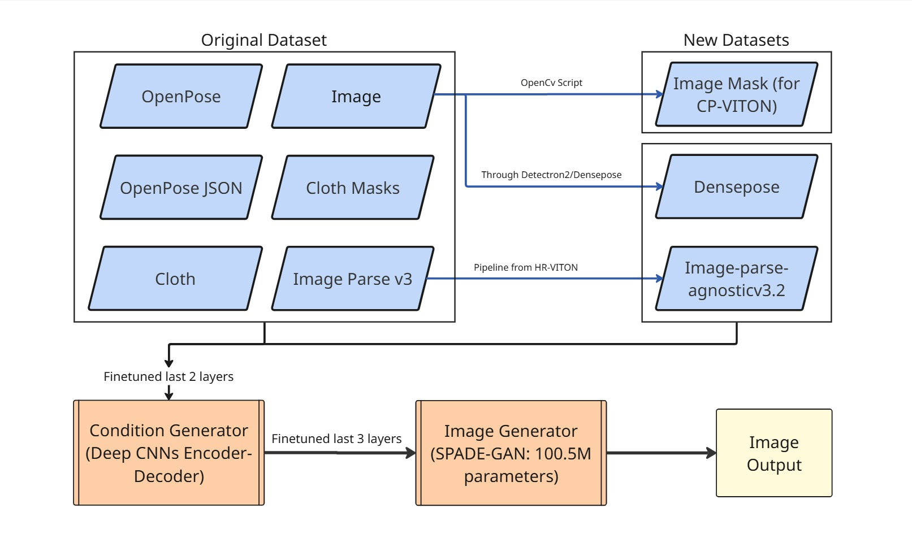

# FASHIONATE

> An AI-powered full-stack virtual fashion styling and recommendation platform.

Our project blends the following into a unified web platform that understands your fashion sense, recommends what suits your skin tone.


## Try It Live!

### [**✨ Fashionate - Your Fashion Destination ✨**](https://fash-io-nate.vercel.app/)

 **Experience AI-powered fashion recommendations**

---

**Current Status:**
- ✅ Fully functional fashion recommendation system
- ⚠️ Wardrobe is currently shared among all users
- 🔜 Individual user profiles coming soon

## Detailed Documentation:
https://docs.google.com/document/d/17rj-0hl3oz1yn3Gq9TJSe_hsq0bpeobA_2kSxKkKrMo/edit?usp=sharing


## UI Features
- **Filtering**: Seamless filtering integration with brands, dress code, sleeve, fit, and most importantly color.
- **Search Bar**: The search bar understands the context of your search and filters out results. For example: It can handle queries like “Pink Athletic Wear, that go with black pants” and returns the most relevant clothes in the dataset.
- **Virtual Wardrobe**: This feature is to store their whole wardrobe in the platform, which will help the recommender model understand the user’s preference.
- **Buy/Not Interested**: We can buy/reject clothes based on our liking, bought clothes get stored in the virtual wardrobe.
- **Match my Style**: This button is used to align the filtered clothes according to the user’s preference (both positive and negative embeddings), and returns the 20 best clothes.
- **Uniqueness Bar**: The uniqueness bar has 3 modes: “low”, “medium” and “high”. It can be used when the user has selected the Match my Style button, and based on the value of the bar, the model recommends clothes. - Low: Clothes very similar to the user’s liking, High: Clothes just about the user’s style but still unique enough.
- **Wardrobe Builder (Future Prospect)**: Helps the user build an overall balanced wardrobe, we plan to find out ideal wardrobe vectors, and create a model that will recommend clothes, that will make the user’s wardrobe drift towards the ideal wardrobe. The Ideal wardrobe can be defined as one where every type of cloth type exists.

## Example of the "Match my Style" functionality based on user preferences and past choices:


---
## Process Flow:
### Recommendation System:

### VITON:

## Features

### 1. Skin Color Compatibility Model
Recommends clothing colors that suit your skin tone.
- Uses segmentation to extract skin regions (face, arms, neck).
- Dominant skin tone is detected in HSV space via KMeans.
- A trained ANN predicts whether a skin–clothing color pair is a good match.

---

### 2. Fashion Designer Model – Part A (Attribute Recombination)
Recombines garment attributes to design novel outfit ideas.
- Attributes: sleeve type, neck type, color, fit.
- ANN trained to interpolate between attribute vectors of two garments.
- Output is a new blended garment style (e.g., sleeve from one, color from another).

---

### 3. Fashion Designer Model – Part B (Neural Style Transfer)
Transfers the **style** (e.g. print, texture) of one garment onto the **structure** (fit, shape) of another.
- Uses pre-trained **VGG19**.
- Balances content and style loss to generate novel clothing designs.

---

### 4. Dataset & Embedding Vectors
- Garment metadata (sleeve, neck, color, fit, etc.) enriched via a Vision-Language Model (Qwen-2.5-VL).
- Images embedded using Swin Transformer (2048-dim visual vector).
- Descriptions embedded using `all-mpnet-base-v2` (Sentence Transformers).

---

### 5. Recommendation System
- Learns user style using "Bought" and "Not Interested" tags.
- Uses **HNSW + MMR** for diverse and relevant results.
- Uniqueness Bar adjusts recommendation diversity using Maximal Marginal Relevance.

---

### 6. Natural Language Search
- Query clothes by natural phrases like “Red sleeveless party wear”.
- Uses Qwen-2B + SentenceTransformer to encode garment metadata and text descriptions.
- Searches top-k matches with **FAISS**.

---

## Other models, not implemented in web package:
### Virtual Try-On (SD-VITON)
- Squeezing-averse virtual try-on using **Sequential Deformation (SD-VITON)**.
- Pipeline:
  - Person image + clothing + pose + segmentation + DensePose
  - Condition Generator: UNet with TVOB and TACO layers
  - Generator: SPADE GAN for realistic synthesis

#### Metrics:
| Metric   | Score     |
|----------|-----------|
| SSIM     | 0.776     |
| LPIPS    | 0.222     |
| MSE      | 0.044     |
| FID      | 52.91     |
| IS       | 3.55   |

---

## Tech Stack

- **Frontend**: ReactJS (with UI filters & search)
- **Backend**: FastAPI + Celery
- **Storage**: Supabase (image storage)
- **ML Models**: PyTorch (ANN, Style Transfer, VITON)
- **Search & Rec**: FAISS, HNSW, MMR
- **Embeddings**: Swin Transformer, SentenceTransformer

## Run inside SDVITON Directory
### Try-On Finetuning (SD-VITON Condition Generator)
```bash
python3 train_condition.py \
  --gpu_ids 0 --Ddownx2 --Ddropout --interflowloss --occlusion \
  --tvlambda_tvob 2.0 --tvlambda_taco 2.0 \
  --dataroot ./my_data/ --data_list train_pairs.txt \
  --tocg_checkpoint checkpoints/tocg.pth \
  --batch-size 2 --save_count 1000 --G_lr 0.00015 --D_lr 0.00015 \
  --workers 4 --checkpoint_dir checkpoints/finetune_cond \
  --name finetune_cond --unfreeze_last 2 --keep_step 10000
```
### Try-On Finetuning (SD-VITON Image Generator)
```bash
  python train_generator.py --name finetune_gen -b 1 -j 0 --gpu_ids 0 --fp16 --tocg_checkpoint \
checkpoints/finetune_cond/tocg_step_007000.pth --dataroot ./my_data/ --data_list train_pairs.txt \
--occlusion --composition_mask --unfreeze_last 2 --keep_step 10000 --save_count 1000 --decay_step 5000
```
### Try-On Inference:
```bash
  python test_generator.py --gen_checkpoint ./checkpoints/toig.pth --tocg_checkpoint \
./checkpoints/tocg_step_007000.pth --gpu_ids 0 --dataroot ./my_data/ \
--data_list test_pairs.txt --test_name ctest --workers 1
```


